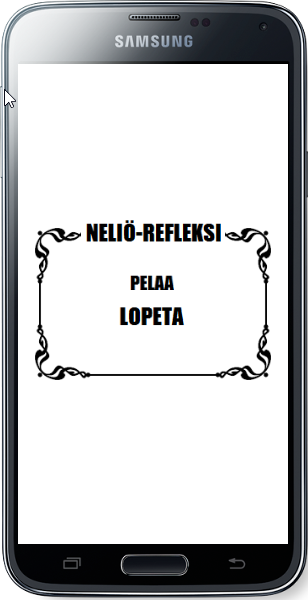
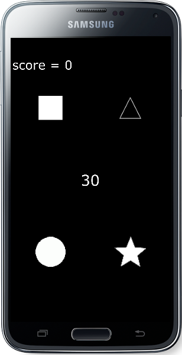

# simple-mobile-game
My first mobile game, simple reflex type game where you have to click the correct shape to collect as many points in 30 seconds as you can.

 

i also uploaded a short video demonstrating the game [here](https://www.youtube.com/watch?v=PozrsMl_FIU&feature=youtu.be)

## Installing
Since this isn´t exactly a "finished product", i recommend using the
* [Corona SDK](https://coronalabs.com/) 
</a>

for testing purposes to avoid possible errors and complications due to differing software.

after you have downloaded and installed Corona, download also this repository. Then,
1. Open Corona simulator
2. "Open Project"
3. locate the downloaded repository
4. locate and open the "main.lua" file inside "reaktio" folder.

and you should be good to go.
